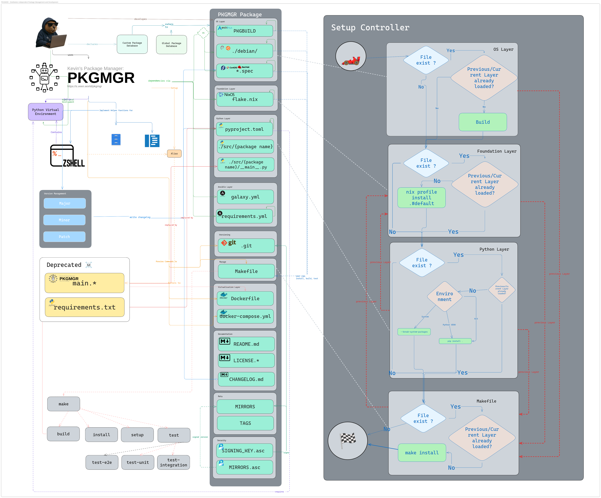

# Package Manager🤖📦
[](https://github.com/sponsors/kevinveenbirkenbach)
[](https://www.patreon.com/c/kevinveenbirkenbach) 
[](https://buymeacoffee.com/kevinveenbirkenbach) [](https://s.veen.world/paypaldonate)
[](LICENSE)
[](https://github.com/kevinveenbirkenbach/package-manager)

*Kevins's* Package Manager is a configurable Python tool designed to manage multiple repositories via Bash. It automates common Git operations such as clone, pull, push, status, and more. Additionally, it handles the creation of executable wrappers and alias links for your repositories.

## Features 🚀

- **Installation & Setup:**  
  Create executable wrappers with auto-detected commands (e.g. `main.sh` or `main.py`).
  
- **Git Operations:**  
  Easily perform `git pull`, `push`, `status`, `commit`, `diff`, `add`, `show`, and `checkout` with extra parameters passed through.
  
- **Configuration Management:**  
  Manage repository configurations via a default file (`config/defaults.yaml`) and a user-specific file (`config/config.yaml`). Initialize, add, delete, or ignore entries using subcommands.
  
- **Path & Listing:**  
  Display repository paths or list all configured packages with their details.
  
- **Custom Aliases:**  
  Generate and manage custom aliases for easy command invocation.

## Architecture & Setup Map 🗺️

The following diagram provides a full overview of PKGMGR’s package structure,
installation layers, and setup controller flow:



**Diagram status:** *Stand: 10. Dezember 2025*  
**Always-up-to-date version:** https://s.veen.world/pkgmgrmp

## Installation ⚙️

Clone the repository and ensure your `~/.local/bin` is in your system PATH:

```bash
git clone https://github.com/kevinveenbirkenbach/package-manager.git
cd package-manager
```

Install make and pip if not installed yet:

```bash
pacman -S make python-pip
```

Then, run the following command to set up the project:

```bash
make setup
```

The `make setup` command will:
- Make `main.py` executable.
- Install required packages from `requirements.txt`.
- Execute `python main.py install` to complete the installation.

## License 📄

This project is licensed under the MIT License.

## Author 👤

Kevin Veen-Birkenbach  
[https://www.veen.world](https://www.veen.world)
